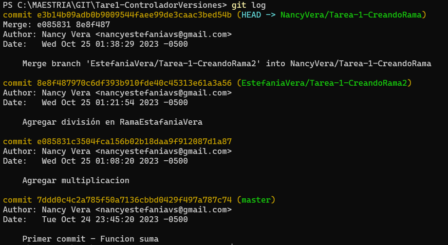

# Tarea-1
Tarea 1 de la materia controlador de versiones de la Maestría en Diseño Web y Desarrollo de Apps.
&nbsp;  
**Autora:** Nancy Vera Solórzano 
# Controlador Versiones
Permite registrar y controlar los cambios en archivos y proyectos a lo largo del tiempo, permitiendo un seguimiento preciso de quién hizo qué cambio, cuándo y por qué. Esto es fundamental para la colaboración en equipos, la gestión de proyectos y la recuperación de versiones anteriores. 
# Comandos de Git
## Instalación y configuración básica de Git
  
- Para configurar el nombre de usuario: **$ git config --global user.name "Nancy Vera"**
- Para configurar el correo electrónico: **$ git config --global user.email "nancy_vera_mdw@espam.edu.ec"**
- Para crear una carpeta, usa el comando mkdir (make directory): **mkdir NombreCarpeta**  

- Para cambiar al directorio recién creado usando el comando cd (change directory): **cd NombreCarpeta**  

## Creación de un Repositorio Local 
- Para inicializar un repositorio Git dentro de esta carpeta, puedes ejecutar: **git init**   

- Para comprobar que tenga GIT, puedes ejecutar:  **git**  

- Luego se debe crear un archivo dentro de la carpeta ya creada e inicializada para este ejemplo se escoge trabajar con Visual Studio Code, para eso puede utilizar el siguiente comando: **code .**
- Se debe crear el archivo:  

- Prepara un archivo para ser incluido en el próximo commit: **git add index.js**
- Permite saber donde estamos, que cambios se ha realizado, es decir, muestra el estado actual de los archivos en el repositorio: **git status**    
**EJEMPLO DE LOS ULTIMOS LITERALES**  

- Registrar los cambios en un nuevo commit junto con un mensaje descriptivo: **git commit -m "Mensaje del commit"**  

- Permite ver todo los commit realizado dentro del repositorio, es decir, muestra el historial de commits del repositorio.: **git log**  
- Para visualizar cambios ejecutados dentros de los archivos: **git diff**  

- Permite preparar todos los archivos modificados para ser incluidos en el próximo commit: **git add .**  
  

## Ramas en profundidad: creación, fusión y resolución de conflictos  
- Crear una nueva rama con el nombre especificado. debe ejecutar: **git branch nombre_rama** o **git checkout -b**
   
Ejemplo sobre la creación de rama y agregar un commit en la misma

- Cambiar de Rama: **git checkout**  

Ejemplo sobre los dos ultimos literales:
  
- Lista las ramas en el repositorio: **git branch**  
  
- Para fusionar los cambios de la otra rama en la rama actual: **git merge**  
  
  

  
- **PS C:\MAESTRIA\GIT\Tare1-ControladorVersiones> git commit**    
      
- **Para salir:q!**  

- El puntero **HEAD** en Git es una referencia que señala al último commit en la rama actual en la que estás trabajando.
## Etiquetas y versionado semántico
- **Las etiquetas (tags):** Se utilizan para marcar puntos específicos o momentos claves en la historia de un repositorio, comando: **git tag**. 
-  El versionado semántico se basa en un formato de versión que consta de tres números: X.Y.Z (por ejemplo, 1.2.3).Cuando realizas cambios importantes y potencialmente disruptivos en la API o la funcionalidad, aumentas el número de versión principal (X). Cuando agregas nuevas características de forma compatible hacia atrás, aumentas el número de versión menor (Y). Cuando haces correcciones de errores o ajustes menores, aumentas el número de revisión (Z).

**Consola:**  
  
## Gitignore y gestión de archivos binarios y sensibles
- El archivo **.gitignore** se utiliza para especificar  archivos o directorios que Git debe ignorar al realizar seguimiento de los cambios en el repositorio. Los archivos o directorios listados en el archivo .gitignore no serán rastreados por Git y no se incluirán en los commits. Esto es útil para evitar que archivos innecesarios, como archivos temporales, archivos de compilación, o archivos generados, se agreguen al repositorio.
- El archivo **secrets.yml** se utiliza para almacenar información confidencial, como claves secretas y tokens de autenticación. Este archivo contiene secretos que deben mantenerse seguros y no deben estar expuestos públicamente en un repositorio Git. Para asegurarte de que el archivo secrets.yml y otros archivos confidenciales no se incluyan en tu repositorio Git, debes agregar sus nombres correspondientes en el archivo .gitignore
## Hooks de Git y automatización de tareas
- El directorio *.git/hooks* es un scripts llamados "hooks" que se ejecutan automáticamente en respuesta a eventos específicos de Git, como commits, pushes y merges. Estos hooks permiten personalizar y automatizar tareas en el flujo de trabajo de Git, como la ejecución de pruebas o notificaciones antes o después de ciertas acciones. Los hooks son específicos de cada repositorio y pueden ser personalizados por el usuario.  
  
## Git Rebase
 Se utiliza para reorganizar y combinar una secuencia de commits en una rama en lugar de fusionarlos.  
 En resumen, el rebase en Git permite:  
-Mover commits de una rama a otra.
-Colocar los commits en la parte superior de la rama base.
-Mantener un historial de commits más lineal y ordenado
-Comando: **git rebase**

- **git rebase -i HEAD~n** inicia un rebase interactivo que permite reorganizar, fusionar, editar o eliminar los últimos n commits antes del commit actual (HEAD) de manera selectiva. 
- **git rebase -i branch** inicia un rebase interactivo para fusionar commits de la rama actual en la rama especificada. Ambos comandos proporcionan un control completo sobre la historia de los commits, lo que es útil para mantener un historial limpio y ordenado.  

  
  
  
  
- **Finalizar el rebase actual:** Si tienes un rebase en curso y deseas completarlo, puedes usar git rebase --continue si estás satisfecho con el progreso actual, git rebase --abort si deseas cancelar el rebase actual y volver al estado anterior, o git rebase --skip si deseas omitir el commit actual y continuar con el rebase.

  
## Git stash
- El comando **git stash** Se utiliza para guardar temporalmente los cambios que has realizado en tu directorio de trabajo, permitiéndote volver a un estado limpio del repositorio. 
- **Recuperar los cambios del stash:** Para recuperar los cambios guardados en el stash, puedes usar **git stash apply** o **git stash pop** para aplicar los cambios nuevamente a tu directorio de trabajo.

- **Limpiar el stash:** Después de aplicar los cambios del stash, puedes limpiarlo para eliminar los cambios guardados utilizando git stash drop.  
-  **git stash apply stash@{n} o git stash pop stash@{n}:** Se utiliza para aplicar restaurar un conjunto específico de cambios desde una entrada de almacenamiento temporal (stash) anterior en tu directorio de trabajo. La {n} representa el índice del stash que deseas aplicar. Cada stash tiene un índice numérico, comenzando desde 0 para el stash más reciente. Recordando que **git stash apply stash@{n}** no borra cambios sino que copia los datos de la pila y los pegan en sus inicios, **git stash pop stash@{n}** elimina por completo el dato de la pila.
-  Si deseas eliminar el stash después de aplicarlo, puedes utilizar **git stash drop stash@{n}**
- **git checkout -- .** se utiliza para descartar o restaurar todos los cambios no confirmados en los archivos del directorio de trabajo y volverlos al estado del último commit. Si solo deseas descartar cambios en archivos específicos en lugar de todos los archivos, puedes proporcionar las rutas de esos archivos en lugar de . en el comando. Por ejemplo: **git checkout -- archivo1.txt archivo2.txt**  

## Recuperación de cambios eliminados: cherry-pick, revert
- **git cherry-pick** Se utiliza para aplicar un commit específico desde una rama y agregarlo a la rama actual. Cuando se desea traer cambios específicos de una rama a otra sin fusionar la rama completa. comando: **git cherry-pick <commit>** 
- **git revert <commit>** se utiliza para deshacer los cambios realizados en un commit específico y crear un nuevo commit que revierte esos cambios en la rama actual.  

  

# VOCULARIO
 
-**Branches o ramas:** Rama principal es **main** o **master**. Línea de desarrollo independientes.  
-**HEAD:** Es un puntero que permite verificar en que rama y commit nos encontramos.  
-**Staging area o índice:** Estado intermedio entre cambios y  commits.

